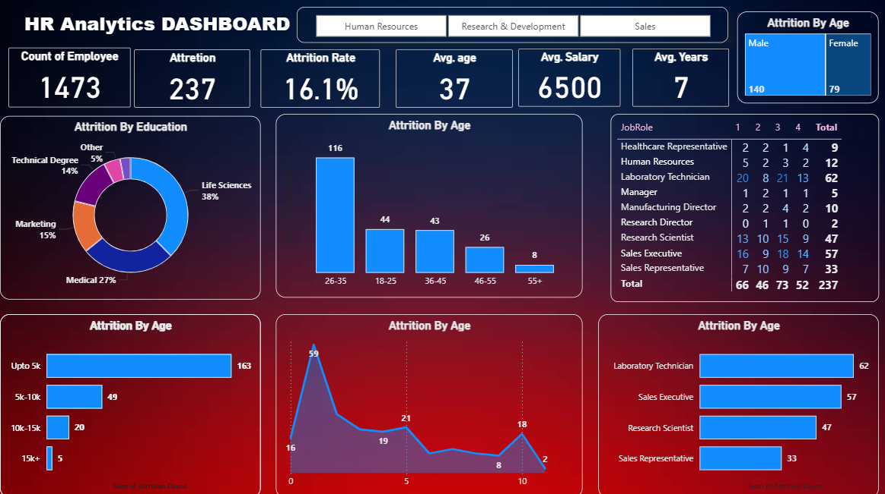

# 📊 HR Analytics Dashboard (Power BI)

## 🔍 Project Overview
This project presents an interactive HR Analytics Dashboard built using Power BI to analyze employee attrition, salary trends, and workforce insights. It helps organizations make data-driven HR decisions.

## 🛠 Tools Used
- Power BI  
- Power Query  
- DAX  
- Excel  

## 📈 Key Insights
- Attrition rate is 16.1%
- Highest attrition in age group 26–35
- Life Sciences & Medical backgrounds have more attrition
- Laboratory Technicians & Sales Executives are most affected
- Low salary group (up to 5K) shows highest attrition

## 📊 Dashboard Features
- KPI cards (Employees, Attrition, Avg Salary, Age)
- Attrition analysis by Age, Education, Salary & Job Role
- Department-wise filtering
- Interactive visuals

## 📷 Dashboard Preview

## 📂 Files Included
- project 1.pbix
- Data HR_Analytics.csv

## 💡 Conclusion
Attrition is mainly influenced by salary, age, and job roles. Companies can improve retention by focusing on compensation and employee growth strategies.
